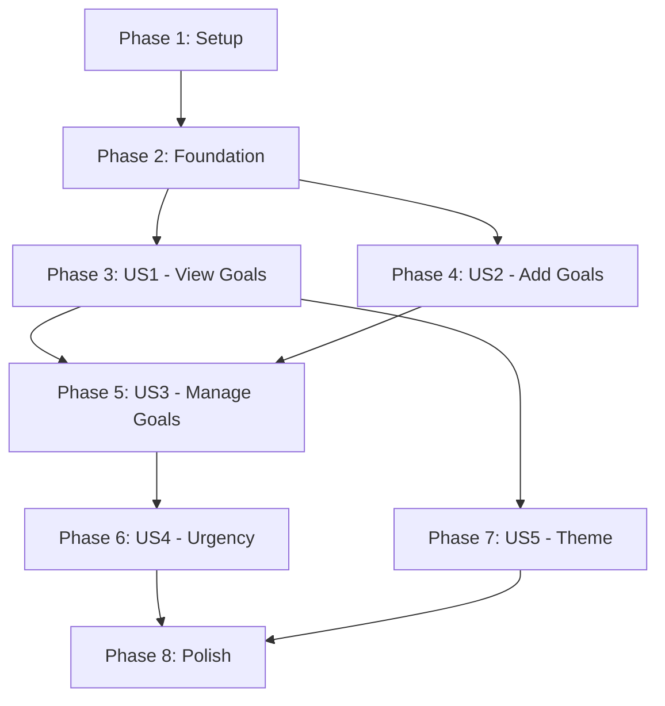

# Tasks: DoIt Goal Tracking App

**Input**: Design documents from `/specs/001-doit-app/`  
**Prerequisites**: plan.md, spec.md, research.md, data-model.md, quickstart.md

**Constitutional Requirement**: Per project constitution, automated testing is PROHIBITED. All verification must be done manually through browser testing.

**Organization**: Tasks are grouped by user story to enable independent implementation and manual verification of each story.

## Format: `[ID] [P?] [Story] Description`

- **[P]**: Can run in parallel (different files, no dependencies)
- **[Story]**: Which user story this task belongs to (e.g., US1, US2, US3)
- Include exact file paths in descriptions

## Path Conventions

- **Next.js app**: `app/`, `public/` at repository root (no test directories)
- **Components**: `app/components/` for React components
- **Utilities**: `app/lib/` for pure functions
- **Hooks**: `app/hooks/` for custom React hooks

---

## Phase 1: Setup (Shared Infrastructure)

**Purpose**: Project initialization and dependency installation

- [ ] T001 Install shadcn/ui: Run `npx shadcn@latest init` in project root
- [ ] T002 [P] Install date-fns: Run `npm install date-fns` 
- [ ] T003 [P] Add shadcn Dialog component: Run `npx shadcn@latest add dialog`
- [ ] T004 [P] Add shadcn Button component: Run `npx shadcn@latest add button`
- [ ] T005 [P] Add shadcn Input component: Run `npx shadcn@latest add input`
- [ ] T006 [P] Add shadcn Label component: Run `npx shadcn@latest add label`
- [ ] T007 Configure Tailwind @theme with pastel colors in app/globals.css

---

## Phase 2: Foundational (Blocking Prerequisites)

**Purpose**: Core infrastructure that MUST be complete before ANY user story can be implemented

**⚠️ CRITICAL**: No user story work can begin until this phase is complete

- [ ] T008 [P] Create TypeScript types in app/lib/types.ts (Goal interface, GoalStatus type)
- [ ] T009 [P] Create date utility functions in app/lib/date-utils.ts using date-fns (calculateDaysRemaining, getDaysRemainingText, getUrgencyLevel)
- [ ] T010 [P] Create localStorage utility functions in app/lib/storage.ts (saveGoals, loadGoals, STORAGE_KEY constant)
- [ ] T011 Create useLocalStorage hook in app/hooks/useLocalStorage.tsx (generic localStorage hook with error handling)
- [ ] T012 Create useGoals hook in app/hooks/useGoals.tsx (depends on T008, T010, T011 - manages goal state, provides CRUD operations, handles sorting)

**Checkpoint**: Foundation ready - user story implementation can now begin in parallel

---

## Phase 3: User Story 1 - View and Organize Goals (Priority: P1) 🎯 MVP

**Goal**: Display active and completed goals in two columns with countdown timers and proper sorting

**Manual Verification**: Load app with mock goals, verify columns display correctly, sorting works (active by deadline, completed by completion date), empty states show when no goals exist

### Implementation for User Story 1

- [ ] T013 [P] [US1] Create GoalColumn component in app/components/GoalColumn.tsx (reusable column container with title and children)
- [ ] T014 [P] [US1] Create EmptyState component in app/components/EmptyState.tsx (display message when no goals in column)
- [ ] T015 [US1] Create GoalCard component in app/components/GoalCard.tsx (depends on T009 - display goal with title, days remaining, checkbox, conditional styling based on urgency)
- [ ] T016 [US1] Update app/page.tsx to use useGoals hook (depends on T012, T013, T014, T015 - render two columns, pass activeGoals and completedGoals to GoalColumn components)
- [ ] T017 [US1] Add responsive layout to app/page.tsx using Tailwind (flex-col on mobile <768px, flex-row on tablet/desktop)
- [ ] T018 [US1] Implement empty state logic in GoalColumn (show EmptyState component when goals array is empty)
- [ ] T019 [US1] Manual browser verification across viewports (mobile 375px, tablet 768px, desktop 1920px)

**Checkpoint**: At this point, User Story 1 should be fully functional and manually verifiable independently. Goals display in sorted order with countdown timers.

---

## Phase 4: User Story 2 - Add New Goals (Priority: P2)

**Goal**: Users can create new goals via modal form with validation

**Manual Verification**: Click Add Goal button, fill form with title and date, submit to see goal appear in active column; test validation by submitting empty fields or past dates

### Implementation for User Story 2

- [ ] T020 [P] [US2] Create AddGoalButton component in app/components/AddGoalButton.tsx (floating action button or prominent button to open modal, onClick handler to toggle modal state)
- [ ] T021 [US2] Create AddGoalModal component in app/components/AddGoalModal.tsx (depends on T008, shadcn Dialog, Button, Input, Label - modal form with title input, date picker, validation, onSubmit handler)
- [ ] T022 [US2] Add modal state management to app/page.tsx (useState for isModalOpen, pass to AddGoalButton and AddGoalModal)
- [ ] T023 [US2] Implement form validation in AddGoalModal (title not empty after trim, endDate selected, endDate not in past, display inline error messages)
- [ ] T024 [US2] Connect AddGoalModal to useGoals addGoal function (call addGoal on valid submission, close modal, reset form)
- [ ] T025 [US2] Add modal close behaviors (ESC key closes modal via shadcn Dialog, click outside closes modal, cancel button closes modal)
- [ ] T026 [US2] Style AddGoalButton with pastel theme colors and ensure minimum 44x44px touch target
- [ ] T027 [US2] Manual browser verification: Add goals with various titles and dates, test validation errors, test modal close behaviors

**Checkpoint**: Users can add new goals that immediately appear in the active column with proper validation.

---

## Phase 5: User Story 3 - Complete or Delete Goals (Priority: P3)

**Goal**: Users can complete, uncomplete, or delete goals with inline action buttons

**Manual Verification**: Click checkbox on active goal to show Complete/Delete buttons, complete goal to move to completed column, click completed goal to show Uncomplete/Delete buttons, test overdue goal shows only Delete

### Implementation for User Story 3

- [ ] T028 [US3] Add checkbox and action button state to GoalCard component (useState for showActions, checkbox onClick toggles showActions)
- [ ] T029 [US3] Add inline action buttons to GoalCard for active goals (Complete and Delete buttons, conditional rendering based on showActions, styled with Tailwind transitions)
- [ ] T030 [US3] Connect Complete button to useGoals completeGoal function (onClick calls completeGoal(goal.id), hides action buttons)
- [ ] T031 [US3] Connect Delete button to useGoals deleteGoal function (onClick calls deleteGoal(goal.id))
- [ ] T032 [US3] Implement overdue goal logic in GoalCard (depends on T009 - if goal is overdue, show only Delete button, hide Complete button)
- [ ] T033 [US3] Add action buttons for completed goals in GoalCard (Uncomplete and Delete buttons, conditional rendering for status==='completed')
- [ ] T034 [US3] Connect Uncomplete button to useGoals uncompleteGoal function (onClick calls uncompleteGoal(goal.id), moves goal back to active with original endDate)
- [ ] T035 [US3] Add smooth transition animations with Tailwind (transition-all duration-300 for goal movements, transition-opacity for action buttons)
- [ ] T036 [US3] Update GoalCard to hide countdown timer for completed goals (conditional rendering based on status)
- [ ] T037 [US3] Manual browser verification: Complete goals, uncomplete goals, delete from both columns, test overdue goal restrictions

**Checkpoint**: Full goal lifecycle works - active → completed → uncomplete/delete with proper validation and smooth UX.

---

## Phase 6: User Story 4 - Deadline Urgency Highlighting (Priority: P4)

**Goal**: Visual highlighting for goals within 3 days of deadline or overdue

**Manual Verification**: Create goals with various deadlines (overdue, 2 days, 5 days), verify highlighting appears correctly and is distinguishable

### Implementation for User Story 4

- [ ] T038 [US4] Add urgency styling logic to GoalCard component (depends on T009 - call getUrgencyLevel(goal), apply conditional Tailwind classes based on urgency)
- [ ] T039 [US4] Define pastel urgency colors in app/globals.css @theme (overdue: red pastel border/background, urgent: yellow pastel border/background, normal: default)
- [ ] T040 [US4] Apply urgency classes to GoalCard wrapper (className with conditional logic for border and background colors)
- [ ] T041 [US4] Ensure color contrast meets accessibility standards (verify text readable on all urgency backgrounds, minimum 4.5:1 contrast ratio)
- [ ] T042 [US4] Manual browser verification: Test with goals at different urgency levels, verify highlighting is visible and distinguishable, check across mobile/tablet/desktop

**Checkpoint**: Goals have clear visual urgency indicators that help users prioritize.

---

## Phase 7: User Story 5 - Pastel Theme Visual Design (Priority: P5)

**Goal**: Consistent pastel color theme throughout the application

**Manual Verification**: Load app on multiple devices, verify all UI elements use pastel colors consistently, check contrast and readability

### Implementation for User Story 5

- [ ] T043 [P] [US5] Define complete pastel color palette in app/globals.css @theme (primary: pink, secondary: green, accent: blue, warning: yellow, danger: orange, background: light gray, surface: white)
- [ ] T044 [P] [US5] Apply pastel theme to GoalCard background and borders (use CSS variables from @theme, different shades for active vs completed)
- [ ] T045 [P] [US5] Apply pastel theme to AddGoalButton (use primary or accent color with hover states)
- [ ] T046 [P] [US5] Apply pastel theme to AddGoalModal (surface color for modal background, pastel borders for inputs)
- [ ] T047 [P] [US5] Apply pastel theme to action buttons (Complete: green pastel, Delete: orange pastel, Uncomplete: blue pastel, with hover states)
- [ ] T048 [US5] Set overall page background to light pastel color (update app/page.tsx or app/layout.tsx with background-color)
- [ ] T049 [US5] Ensure consistent pastel theme across all components (review all components for color usage, replace any harsh colors)
- [ ] T050 [US5] Manual browser verification: Check theme consistency on mobile, tablet, desktop; verify pleasant appearance; test color contrast for accessibility

**Checkpoint**: Application has cohesive, pleasant pastel design that motivates users.

---

## Phase 8: Polish & Cross-Cutting Concerns

**Purpose**: Final refinements, optimization, and comprehensive manual verification

- [ ] T051 Add loading state handling to app/page.tsx (show loading spinner or skeleton while useGoals isLoading is true)
- [ ] T052 Add hover states and focus states to all interactive elements (buttons, checkboxes, inputs with Tailwind focus: and hover: utilities)
- [ ] T053 Verify keyboard navigation works throughout app (tab through form fields, ESC closes modal, Enter submits form)
- [ ] T054 Add smooth scroll behavior for long goal lists (CSS scroll-behavior: smooth or Tailwind scroll-smooth)
- [ ] T055 Optimize component re-renders with React.memo where appropriate (GoalCard, EmptyState if performance issues)
- [ ] T056 Add error handling for localStorage quota exceeded (try-catch in storage.ts, show user-friendly message)
- [ ] T057 Test with 50+ goals to verify performance remains smooth (add script to generate test goals, verify no lag)
- [ ] T058 Final responsive design verification across all breakpoints (mobile 375px, 768px, 1024px, 1920px)
- [ ] T059 Final accessibility verification (screen reader compatibility, keyboard-only navigation, color contrast)
- [ ] T060 Cross-browser testing (Chrome, Firefox, Safari, Edge - verify all features work)
- [ ] T061 Update README.md with setup instructions, development guide, and manual verification scenarios from quickstart.md

---

## Dependencies & Parallel Execution

### Story Dependencies (Completion Order)

**Key Dependencies**:
- Phase 2 must complete before any user story work begins
- US3 (Manage Goals) depends on both US1 (viewing) and US2 (adding)
- US4 (Urgency) depends on US3 (needs goal management complete)
- US5 (Theme) can start after US1 (parallel with US2-US4)
- Polish phase requires all user stories complete

### Parallel Execution Examples

**Within Phase 1 (Setup)**:
- T002-T006 can all run in parallel (installing different dependencies)

**Within Phase 2 (Foundation)**:
- T008-T010 can run in parallel (creating utility files)
- T011-T012 must run sequentially (hooks depend on types and storage)

**Within Phase 3 (US1)**:
- T013-T015 can run in parallel (independent components)
- T016-T019 must run sequentially (page integration and verification)

**Within Phase 7 (US5)**:
- T043-T047 can run in parallel (styling different components)
- T048-T050 must run sequentially (overall theme and verification)

**Across Phases**:
- Once US1 is complete, can start both US2 and US5 simultaneously
- US4 and remaining US5 tasks can run in parallel

---

## Implementation Strategy

### MVP First (Minimum Viable Product)
- **Phase 1-3 (Setup + Foundation + US1)** = MVP
- Delivers core value: View existing goals with countdown timers
- Can be demoed and provides immediate utility
- Estimated time: 40% of total effort

### Incremental Delivery
1. **Week 1**: MVP (Phases 1-3) - Users can see goals
2. **Week 2**: US2 (Phase 4) - Users can add goals
3. **Week 3**: US3 (Phase 5) - Users can manage lifecycle
4. **Week 4**: US4-US5 (Phases 6-7) - Polish with urgency and theme
5. **Week 5**: Phase 8 - Final polish and verification

### Task Execution Tips
- Mark tasks complete immediately after finishing
- Follow the strict checkbox format for each task
- Use [P] marker to identify parallelizable tasks
- Refer to quickstart.md for manual verification steps
- Each phase should result in a working, demonstrable increment

---

## Summary Statistics

**Total Tasks**: 61
**Tasks by Phase**:
- Phase 1 (Setup): 7 tasks
- Phase 2 (Foundation): 5 tasks
- Phase 3 (US1): 7 tasks
- Phase 4 (US2): 8 tasks
- Phase 5 (US3): 10 tasks
- Phase 6 (US4): 5 tasks
- Phase 7 (US5): 8 tasks
- Phase 8 (Polish): 11 tasks

**Parallelizable Tasks**: 19 marked with [P]

**Manual Verification Points**: 9 dedicated verification tasks (T019, T027, T037, T042, T050, T058, T059, T060, T061)

**MVP Scope**: Phases 1-3 (19 tasks) = Minimal working product
**Full Feature**: All 8 phases (61 tasks) = Complete goal tracking app with polish

**Suggested First Implementation**: Complete Phases 1-3 for immediate value, then iterate through remaining phases based on priority.
